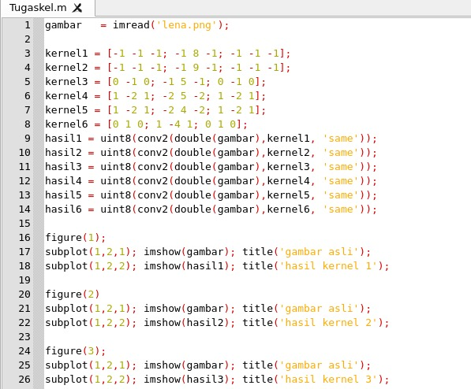
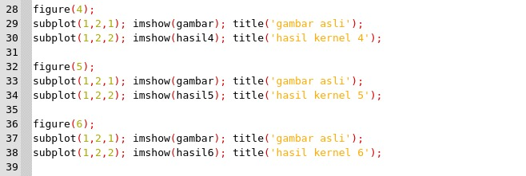
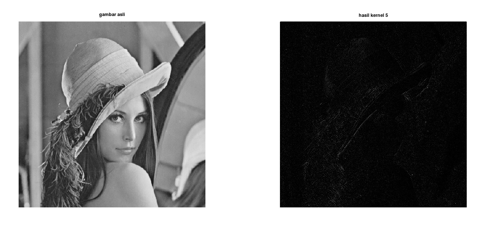
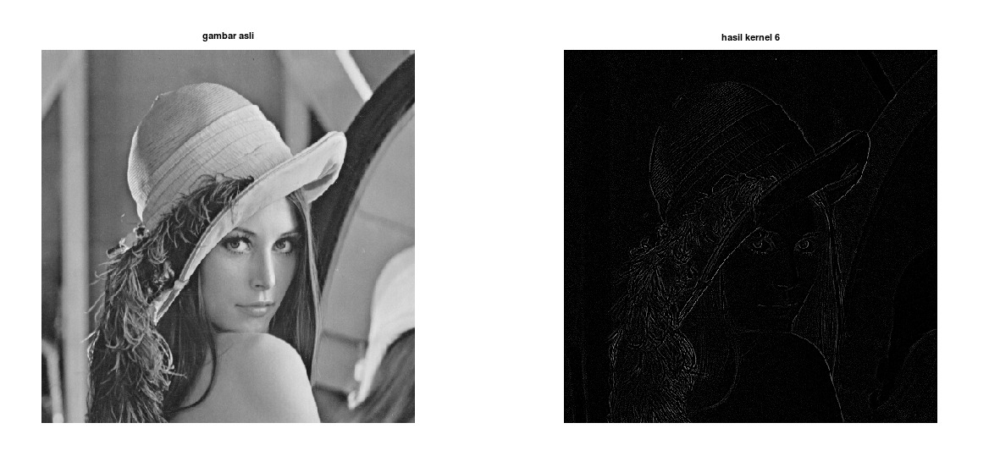
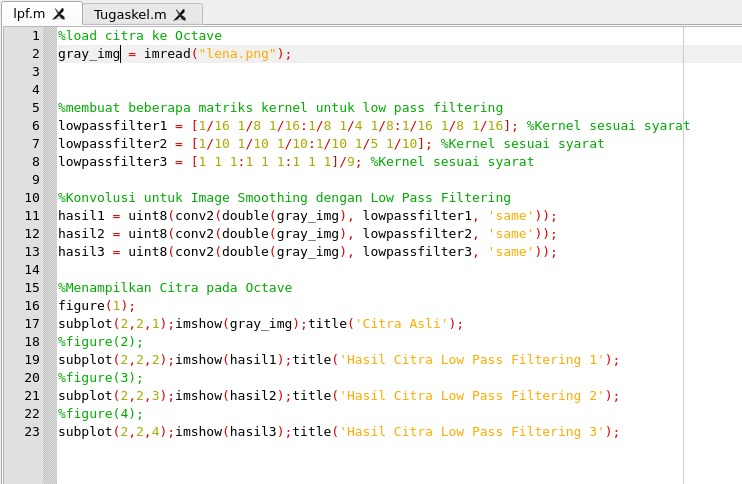
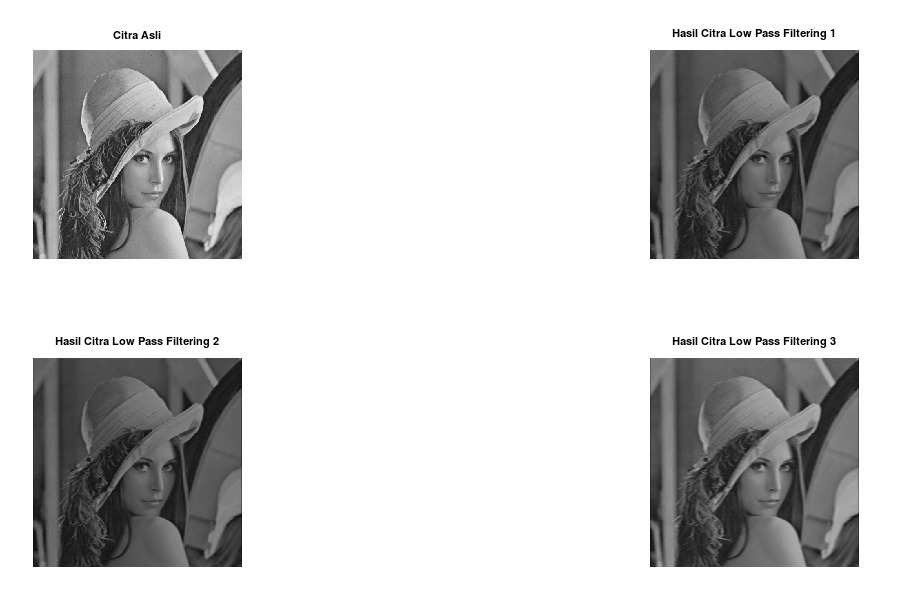

# Kelompok 9

| Nama                    |              Github              |
| ----------------------- | :------------------------------: |
| Sopia Refaldi           |   https://github.com/Srefaldi    |
| Fatimah Azzahra Maulida |    https://github.com/xsjtsra    |
| Khairul Fuad            | https://github.com/khairulfuad09 |

### HPF dan LPF Menggunakan Fungsi

- HPF

- Hasil HPF

- 
Kernel 1

  

- 
Kernel 2

  

- 
Kernel 3

  

- 
Kernel 4

  

- 
Kernel 5

  

- 
 Kernel 6

  

- LPF

- Hasil LPF

