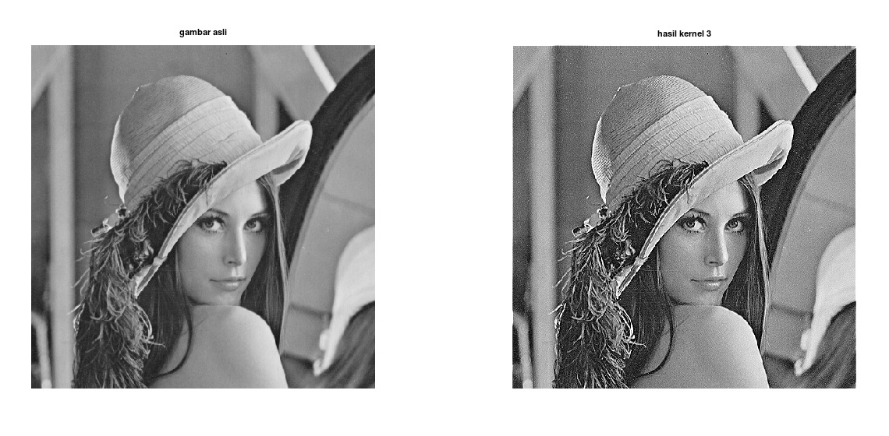
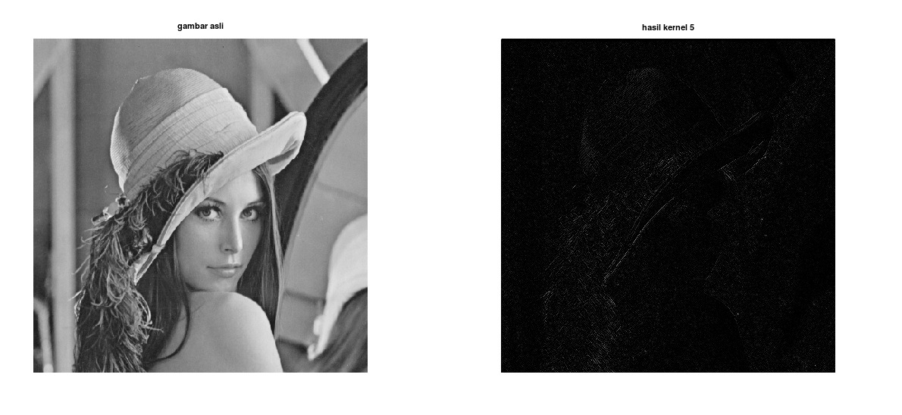

# Kelompok 9

| Nama                    |              Github              |
| ----------------------- | :------------------------------: |
| Sopia Refaldi           |   https://github.com/Srefaldi    |
| Fatimah Azzahra Maulida |    https://github.com/xsjtsra    |
| Khairul Fuad            | https://github.com/khairulfuad09 |

## High Pass Filter

### HPF Menggunakan Fungsi

<b>High Pass Filter (HPF</b> adalah proses filter yang mengambil citra dengan gradiasi intensitas yang tinggi dan perbedaan intensitas yang rendah akan dikurangi atau dibuang. High Pass Filtering adalah salah satu dari metode penajaman (sharpening).

Tujuan utama dari proses penajaman ini adalah untuk menyoroti detail-detail halus dalam gambar atau untuk meningkatkan detail yang telah dikaburkan baik dalam kesalahan atau efek alami dari proses akuisisi citra tertentu.

### _Kegunaan High Pass Filtering_

- High-Pass Filter sering disebut juga sebagai filter penajaman tepi (edge sharpening) karena HPF digunakan dalam proses penajaman citra.

- Operasi penajaman citra bertujuan untuk memperjelas tepi pada objek di dalam citra atau menghilangkan bagian citra yang lembut.

- Karena penajaman citra lebih berpengaruh pada tepi (edge) objek, maka penajaman citra sering disebut juga penajaman tepi (edge sharpening) atau peningkatan kualitas tepi (edge enhancement).
   

### Hasil HPF Menggunakan Fungsi

- 
Kernel 1

  

- 
Kernel 2

  

- 
Kernel 3

  

- 
Kernel 4

  

- 
Kernel 5

  

- 
 Kernel 6

  

### Hasil HPF Manual Tanpa Fungsi

 

## Low Pass Filter

### LPF Menggunakan Fungsi

<b>Low Pass Filtering (LPF)</b> : Proses filter yang melewatkan komponen citra dengan nilai intensitas yang rendah dan meredam komponen citra dengan nilai intensitas yang tinggi. Low Pass Filter disebut juga smoothing filter yang merupakan salah satu metode untuk menghilangkan noise acak, noise berkala, dan menampilkan pola latar belakang. 

Low pass filtering digunakan untuk membuat citra menjadi lebih halus dan lebih blur. Efek pengaburan ini disebut dengan efek blurring.

### _Ciri-ciri Kernel Low Pass Filtering_

- Jumlah semua elemen kernel bernilai satu.

- Elemen kernel tidak ada yang bernilai negatif

- Tinggi dan lebar kernel ganjil, jika tidak bernilai ganjil maka piksel pusat tidak bisa ditemukan.

- Bobot dalam kernel bersifat simetris terhadap piksel pusat

### Hasil LPF Menggunakan Fungsi

### Hasil LPF Manual Tanpa Fungsi

 

## High-Boost Filtering

High-Boost Filtering merupakan salah satu bagian dari operasi yang dapat dilakukan untuk melakukan perbaikan citra.

High-Boost Filtering bertujuan untuk menekankan komponen frekuensi tinggi yang mewakili detail gambar tanpa menghilangkan komponen frekuensi rendah (seperti sharpening). Filter high boost dapat digunakan untuk mengubah komponen frekuensi tinggi.

High boost filter di susun oleh semua pass filter dan edge detection filter (Laplacian filter). Dengan demikian,  High boost filtering menekankan  edge dan menghasilkan image sharpener.

### Hasil HBF Menggunakan Fungsi

### Hasil HBF Manual Tanpa Fungsi

 

### Median Filter

Adalah teknik penyaringan digital nonlinear, sering digunakan untuk menghilangkan noise. Penyaringan median sangat banyak digunakan dalam pemrosesan gambar digital karena mempertahankan tepi sambil menghilangkan noise.

Median filtering dilakukan pada matriks citra dengan cara mencari median dari piksel tetanggaan dengan menggunakan jendela yang menggeser piksel demi piksel.

Penerapan dari median filtering dapat berupa untuk peningkatan kualitas citra gambar yang mengalami penurunan mutu citra, misalnya karena mengandung cacat atau derau (noise). Contohnya adalah bintik hitam atau putih yang muncul secara acak yang tidak diinginkan di dalam citra. 

### Hasil Median Filter Menggunakan Fungsi

### Hasil Median Filter Manual Tanpa Fungsi

'''
% Load citra
image = imread('lena.png');

% Konversi citra ke grayscale jika perlu
if size(image, 3) == 3
image = rgb2gray(image);
endif

% Buat kernel median filter
filter_size = 3;

% Inisialisasi citra yang telah di-filter
filtered_image = zeros(size(image));

% Aplikasikan median filter pada citra secara manual
for i = 1:size(image, 1)
for j = 1:size(image, 2)
% Ambil nilai pixel yang akan di-filter
values = [];
for k = -floor(filter_size/2):floor(filter_size/2)
for l = -floor(filter_size/2):floor(filter_size/2)
if (i+k > 0 && i+k <= size(image, 1) && j+l > 0 && j+l <= size(image, 2))
values = [values, image(i+k, j+l)];
endif
endfor
endfor
% Hitung median dari nilai pixel yang diambil
filtered_image(i, j) = median(values);
endfor
endfor

% Tampilkan citra asli dan citra yang telah di-filter
subplot(1, 2, 1);
imshow(image);
title('Citra Asli');

subplot(1, 2, 2);
imshow(uint8(filtered_image));
title('Citra yang telah di-filter');
'''

### Edge Detection

Tepi (edge) adalah perubahan nilai intensitas derajat keabuan yang mendadak (besar) dalam jarak yang singkat.

Tepi (edge) adalah perubahan nilai intensitas derajat keabuan yang mendadak (besar) dalam jarak yang singkat.

4 macam tepi (edge) :

- Tepi Curam

- Tepi Landai

- Tepi Garis

- Tepi Atap

Edge detection memungkinkan pengguna mengamati fitur gambar untuk perubahan signifikan pada tingkat keabuan. Teksturnya menunjukkan akhir dari satu wilayah dalam gambar dan awal dari wilayah lainnya. Edge detection mengurangi jumlah data dalam suatu gambar dan mempertahankan sifat struktural suatu gambar.

Tujuan Edge Detection

- Untuk bisa mengenali objek di dalam citra (image recognition).

- Pendeteksian tepi merupakan bagian dari analisis citra (image analysis). Tujuan analisis citra: mengidentifikasi parameter-parameter yang diasosiasikan dengan ciri (feature) dari objek di dalam citra, untuk selanjutnya parameter tersebut digunakan dalam menginterpretasi citra.

- Pendeteksian tepi merupakan bagian dari image enhancment. Image enhancement digunakan untuk meningkatkan kualitas suatu citra digital, baik dalam tujuan untuk menonjolkan suatu ciri tertentu dalam citra tersebut maupun untuk memperbaiki aspek tampilan.

### Hasil Edge Detection Menggunakan Fungsi

### Hasil Edge Detection Manual

- Citra Asli

- Output

