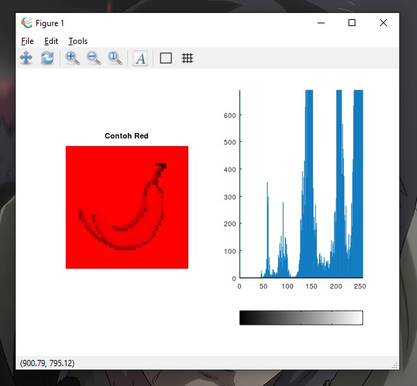
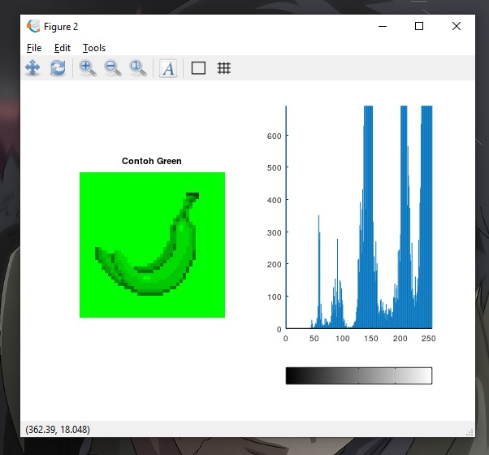
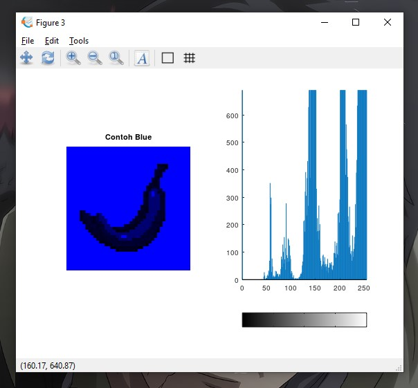
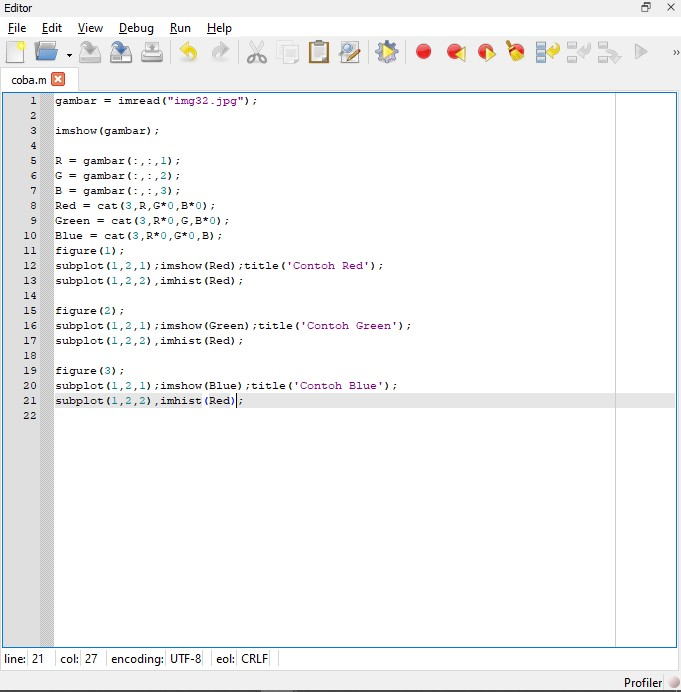

# Hasil Eksplorasi Octave 
## Sopia Refaldi
## 2110131110004

- <b>Figure Red</b>

- <b>Figure Green</b>

- <b>Figure Blue</b>

- <b>Code</b>

Dari Beberapa Contoh foto diatas, Sudah ada beberapa hal baru yang dieskplorasi. Contohnya saja seperti :

- <b>Iamshow</b>

Iamshow Berfungsi untuk menampilkan objek gambar, Contoh prosesnya seperti gambar dibagian materi diatas pertama-tama mendeklarasika iamshow pada variable gambar, lalu ada juga iamshow dibagian masing-masing figure artinya contohnya iamshow(red) artinya menampilkan gambar dengan format yang ditentukan dalam variable red.

- <b>Subplot</b>

Subplot Berfungsi untuk memasukan objek kedalam 1 figure, Cotoh prosesnya dapat dilihat pada gambar bagian code diatas pada figure 1 subplot(1,2,1) maka akan memasukan objek atau nilai yang telah ditentukan ke figure 1

- <b>Iamread</b>

Iamread Berfungsi untuk membaca file image itu berada, Contohnya seperti diline satu, gambar = iamread("img32.jpg") pertama-tama kita memasukan foto tersebut kedalam variable gambar dilanjutkan dengan iamread untuk mencari atau membaca foto yang ingin kita tuju yaitu img32.jpg

- <b>Imhist</b>

Imhist berfungsi untuk menampilkan image dengan bentuk histogram, contohnya seperti gambar dibagian code diatas, pada figure 1 terdapat iamhist(Red) artinya apa? iamhistb disitu berfungsi untuk menampilkan gambar dan variable Red dengan bentuk histogram.

- <b>Cat</b>

 Pada variable Red, Green, Blue itu terdapat code Red = cat(R,G*0,B*0); artinya adalah kita menentukan warna apa yg akan kita tampilkan dan menyimpan gambar yang terfokus pada layer merah saja, untuk yang Blue, dan Green juga sama, hanya saja kita rubah yang R dikalikan 0 dan G tidak untuk di simpan di variabel Green.
