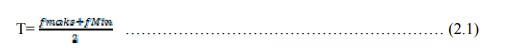
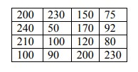
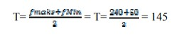
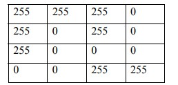

# Tugas 3
## SOPIA REFALDI
## 2110131110004

- Mencoba 3 Rumus :

1. Lightness Method

Lightness Method rumusnya adalah minimal RGB ditambah dengan maximum RGB lalu dibagia dua, dengan hasil gambar output seperti dibawah. Untuk kejelasan gambar hampir beda dengan yang aslinya dikarnakan metode ini menghadirkan kelemahan yang sangat serius karena satu komponen RGB tidak digunakan. Ini jelas merupakan masalah karena jumlah cahaya yang dilihat mata kita bergantung pada ketiga warna dasar.

2. Avarage Method

Avarage Method dengan rumus warna R+G+B lalu dibagi tiga, Hasilnya seperti gambar dibawah untuk tingkat keabuanya dapat membuat mata sakit dikarnakankita memperhitungkan semua komponen, metode rata-rata juga bermasalah karena memberikan bobot yang sama untuk setiap komponen. Berdasarkan penelitian tentang penglihatan manusia, kita tahu bahwa mata kita bereaksi terhadap setiap warna dengan cara yang berbeda. Secara khusus, mata kita lebih sensitif terhadap hijau, lalu merah, dan akhirnya biru. Oleh karena itu, bobot dalam persamaan di atas harus berubah.

3. Luminosity

Metode ini adalah yang terbaik dari dua diatas. Berdasarkan pengamatan di atas, kita harus mengambil rata-rata tertimbang dari komponen. Kontribusi warna biru pada nilai akhir harus berkurang, dan kontribusi warna hijau harus meningkat. Jadi warna keabuan di metode ini sangat jelas dan tepat serta enak dilihat oleh mata.

# Pengertian Halftoning, Patterning, Difhtering

## Halftoning

Halftoning atau halftoning analog adalah proses yang mensimulasikan nuansa abu-abu dengan memvariasikan ukuran titik-titik hitam kecil yang diatur dalam pola yang teratur. Teknik ini digunakan dalam printer, serta industri penerbitan. Jika Anda memeriksa sebuah foto di koran, Anda akan melihat bahwa gambar itu terdiri dari titik-titik hitam meskipun tampaknya terdiri dari abu-abu. Hal ini dimungkinkan karena integrasi spasial yang dilakukan oleh mata kita. Mata kita memadukan detail halus dan merekam intensitas keseluruhan [1]. Halftoning digital mirip dengan halftoning di mana gambar didekomposisi menjadi kotak sel halftone. Elemen (atau titik yang digunakan halftoning dalam mensimulasikan nuansa abu-abu) dari sebuah gambar disimulasikan dengan mengisi sel halftone yang sesuai. Semakin banyak jumlah titik hitam dalam sel halftone, semakin gelap sel tersebut. Misalnya, pada Gambar 4, sebuah titik kecil yang terletak di tengah disimulasikan dalam halftoning digital dengan mengisi sel halftone tengah; demikian juga, titik ukuran sedang yang terletak di sudut kiri atas disimulasikan dengan mengisi empat sel di sudut kiri atas. Titik besar yang menutupi sebagian besar area pada gambar ketiga disimulasikan dengan mengisi semua sel halftone.

## Patterning

Patterining adalah yang paling sederhana dari tiga teknik untuk menghasilkan gambar halftoning digital. Ini menghasilkan gambar yang memiliki resolusi spasial lebih tinggi daripada gambar sumber. Jumlah sel halftone citra keluaran sama dengan jumlah piksel citra sumber. Namun, setiap sel halftone dibagi lagi menjadi kotak 4x4. Setiap nilai piksel input diwakili oleh jumlah kotak terisi yang berbeda dalam sel halftone. 

Matriks pola rekursif Rylander

Operasi Pola

- Contoh Pattering

Pattern menghasilkan gambar halftoning digital dari gambar input menggunakan teknik pola. Pola program membaca gambar input, mengkuantisasi nilai piksel, dan memetakan setiap piksel ke pola yang sesuai. Gambar yang dihasilkan 16 kali lebih besar dari aslinya. Gambar yang dihasilkan ditulis ke file output sebagai file TIFF. Sebuah kata peringatan: "pola" membutuhkan banyak perhitungan, gambar berukuran kurang dari 100x100 direkomendasikan.

## Difhtering

Teknik lain yang digunakan untuk menghasilkan gambar halftoning digital adalah dithering. Tidak seperti pola, dithering membuat gambar keluaran dengan jumlah titik yang sama dengan jumlah piksel pada gambar sumber. Dithering dapat dianggap sebagai thresholding gambar sumber dengan matriks gentar. Matriks diletakkan berulang kali di atas gambar sumber. Dimanapun nilai piksel gambar lebih besar dari nilai dalam matriks, titik pada gambar output diisi. Masalah dithering yang terkenal adalah menghasilkan artefak pola yang diperkenalkan oleh matriks ambang batas tetap. 

- Contoh Difhtering

- ## Menentukan Pola Yang Ada Pada Patterning dan Dithering

- 
Patterning

Bagaimana menentukan pola pada patterning? Pertama-tama kita bisa mengetahui secara langsung dengan menghitung banyaknya font biner atau pattern penggantinya kemudian ditambahkan 1.

Contoh : Menggunakan 2x2 Font biner, Jadi banyak pola yang didapat adalah 9. 

Jadi Kesimpulanya pola yang ada patterning tidah boleh sama atau pola yang sudah ada tidak boleh digunakan lagi. Bisa dilihat seperti gambar dibawah

- 
Difthering

- 
Matriks Tresshold

Threshold dilakukan dengan mempertegas citra dengan cara mengubah citra
hasil yang memiliki derajat keabuan 255 (8 bit), menjadi hanya dua buah yaitu
hitam dan putih. Hal yang perlu diperhatikan pada proses threshold adalah
memilih sebuah nilai threshold (T) dimana piksel yang bernilai dibawah nilai threshold akan diset menjadi hitam dan piksel yang bernilai diatas nilai threshold
akan diset menjadi putih. Umumnya nilai T dihitung dengan menggunakan
persamaan: 

Dimana fmaks adalah nilai intensitas maksimum pada citra dan fmin adalah nilai intensitas minimum pada citra.[6] 

Jika f(x,y) adalah nilai intensitas pixel pada posisi (x,y) maka pixel tersebut
diganti putih atau hitam tergantung kondisi berikut.[1]
f(x,y) = 255, jika f(x,y) ≥ T
f(x,y) = 0, jika f(x,y) < T
Sebagai contoh misalnya diketahui citra grayscale 4x4 pixel dengan kedalaman 8
bit seperti gambar dibawah 

Greyscale 4x4 Pixel

Dengan motede ini, nilai threshold T adalah:

Bila nilai T = 145 diterapkan untuk citra pada Gambar dibawah di atas maka diperoleh
citra seperti pada Gambar dibawah

Hasil Greyscale

- 
Mengapa Pola 4x4 hasilnya kurang bagus dari 16x16?

Kenapa 4x4 tidak sebagus 16x16, Karna Citra yang dihasilkan dari penggunaaan matriks 4x4 memiliki pola halftone yang kurang dibandingkan dengan citra yang diproses menggunakan matriks dithering 16x16. Jumlah piksel dari gambar atau kualitas itu sudah diperkecil jadi hasilnya tidak sebagus 16x16 yang dimana pikselnya lebih banyak.
