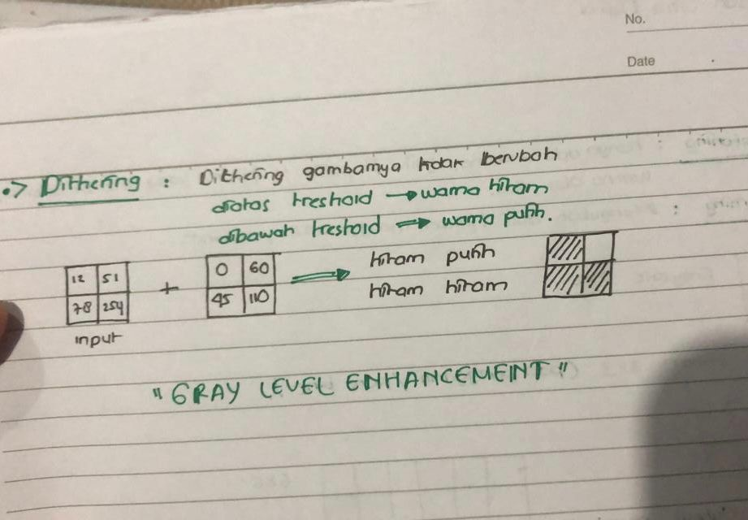
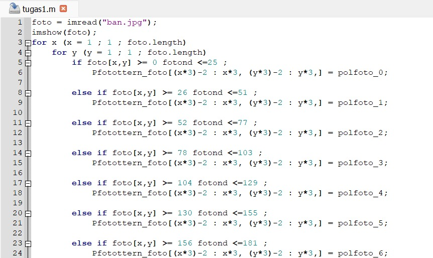

# Sopia Refaldi

# 2110131110004

## Algoritma Dithering

- Menghitung matriks treshold yang akan digunakan untuk membandingkan matriks

- Setelah mendapatkan nilai matriks tresholdnya, bandingkan nilai yang ada pada matriks dengan nilai treshold.

- Jika nilai matriks lebih besar dari treshold maka matriks akan bernilai 0 atau warna yang ditampiilkan adalah hitam.

- Jika nilai matriks lebih kecil dari treshold maka matriks akan bernilai 1 atau berwarna putih.

Contoh :

- Seperti Contoh diatas 12 dibandingkan dengan 0 maka akan menjadi hitam karna nilainya diatas trehold.
- Lalu 51 dibandingkan dengan 60 akan jadi putih karna nilainya lebih kecil dari treshold.

## Algoritma Patterning

- Menentukan banyak pola patterning yang akan digunakan, jika matriks yang digunakan adalah 3x3 maka jumlah pola pattern yang dihasilkan adalah sebanyak 10.

- Menghitung persebaran range nilai dengan mengoperasikan 255 dibagi banyaknya jumlah pola pattern.

- Jika matriks yang digunakan berukuran 3x3 dan font biner yang digunakan berukuran 2x2 maka hasil akhir matriks yang dihasilkan adalah 6x6

- Untuk setiap matriks 3x3 yang berada pada matriks 6x6 mewakili salah satu pola pattern yang ada.

Contoh Penerapan Pada Octave

 
 
 - Contohnya Matriks yang sudah diperbesar jadi 3x3
 - Menggunakan for x yang dimana akan mengakses baris 1 sampai panjang dari baris foto tersebut.
 - For yang y untuk mengambil kolom 1 sampai dengan panjang dari kolom foto tersebut
 - Masuk ke percabangan jika nilai pada foto atau matriks tersebut lebih dari 0 dan kurang dari sama dengan 25 maka pattern pada posisi baris (x*3)-2 sampai x*2 dan kolom (y*3)-2 sampai y*3 pola diisi 0.
 - Percabanganya berikutnya sama ja dengan dipercabanganya yang pertama tadi, misalkan percabangan pertama dari 0 sampai kurang dari 25 maka percabangan kedua 26 ditambah dengan 25 jadi 26 sampai dengan kurang dari 51 sampai dengan 259.

## Algoritma Histogram Equalization

- Menghitung seluruh nilai histogram

- Menormalisasikan jumlah histogram dengan membaginya pada seluruh nilai histogram(jumlah pixel)

- Mengalikan hasil normalisasi histogram dengan banyaknya level bit gambar kemudian dibagi dengan jumlah dari keseluruhan pixel

- Menentukan jumlah masing masing gray level dengan menjumlahkan number of pixel dengan gray level yang sama

## Algoritma Bit Plane Slicing

- Mengubah setiap angka pada matriks menjadi bilangan biner.

- Menyimpan nilai biner dari matriks.

- Tiap 1 buah angka yang ada pada matriks disimpan lagi ke dalam matriks baru sehingga terdapat 8 buah matriks baru dari bilangan biner yang sudah dihasilkan.

- Bilangan biner yang berada di sisi paling kanan adalah last significant bit.

- Bilangan biner yang berada di sisi paling kanan adalah most significant bit
