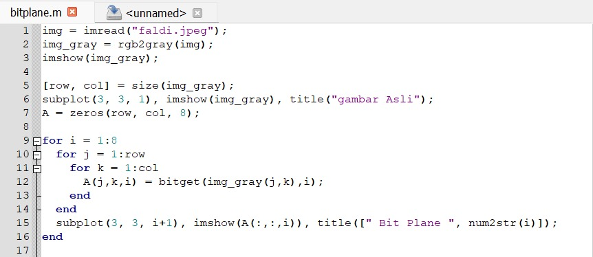
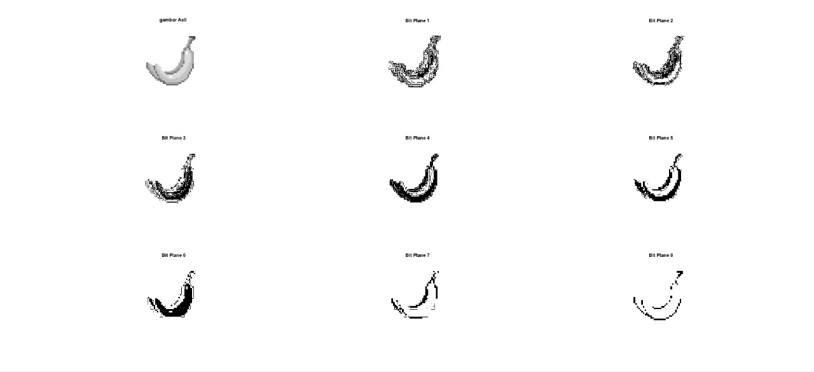
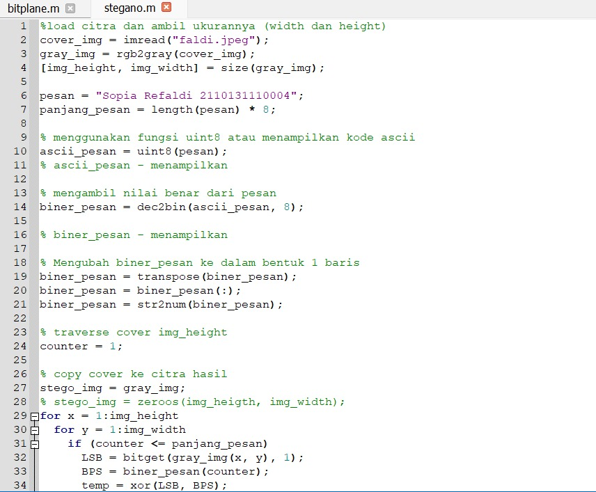
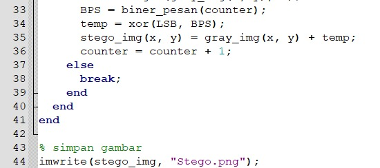
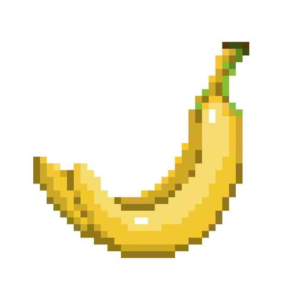
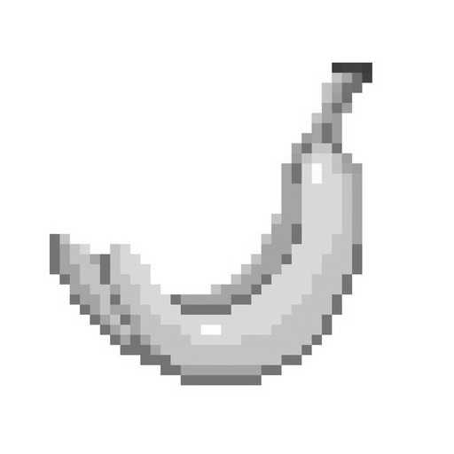

# Tugas Bit Plane Slicing

### Sopia Refaldi - 2110131110004

Untuk Menguraikan bit plane slicing saya menggunakan code seperti gambar dibawah :

- 
Membuat Variable img, lalu membuat variable img gray dengan menggunakan salah satu fungsi dari octave untuk merubah gambar menjadi abu abu yaitu rgb2gray.

- 
Membuat baris dan kolom dengan sesuai size dari variable img tadi

- 
Membuat variable baru dengan isinya kolom dan baris 0 

- 
Melakukan perulangan Baris dan kolom untuk Lalu variable A yang sudah dibikin tadi kita gunakan bitget untuk mendapatkan bit dari gambar tadi dari perulangan baris dan kolom yang sudah dibikin.

- 
Terakhir kita imshow 1:8 gambar tadi.

## STEGANOGRAFI

Code pada octave untuk Stegano Grafi saya menggunakan seperti dibawah :

- Citra asli

- Citra yang sudah disisipkan

Seperti tidak ada pesan yang disiipkan ya pada foto diatas, Untuk melihat atau membuktikan apakah ada pesan rahasia pada foto diatas menggunakan cara seperti dibawah.

