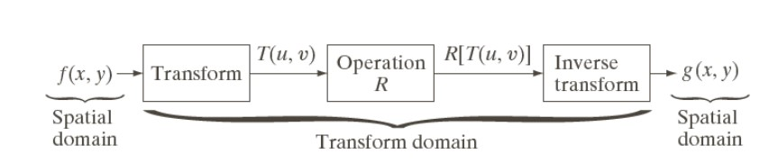
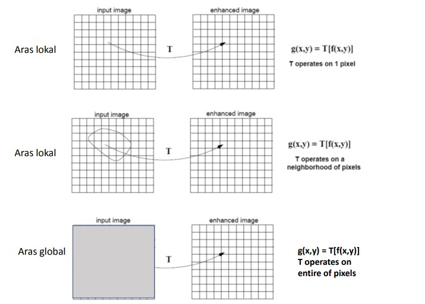

# Metode Spasial Dan Frekuensi Domain

## Sopia Refaldi - 2110131110004

Berdasarkan ranah (domain) operasinya, metode-metode untuk perbaikan
kualitas citra dapat dikelompokkan menjadi dua kategori:

- Image enhancement dalam ranah spasial

Metode-metode image enhancement dalam ranah spasial dilakukan
dengan memanipulasi secara langsung pixel-pixel di dalam citra

- Image enhancement dalam ranah frekuensi

Metode-metode image enhancement dalam ranah frekuensi
dilakukan dengan mengubah citra terlebih dahulu dari ranah spasial
ke ranah frekuensi, baru kemudian memanipulasi nilai-nilai frekuens
tersebut. 

Masing-masing ranah operasi digunakan untuk tujuan spesifik, karena
tidak semua perbaikan citra dapat dilakukan dalam ranah spasial.

## Metode dalam Ranah Spasial

Misalkan:

- <b>f(x,y)</b> : citra input

- <b>g(x,y)</b> : citra output

- T adalah operator terhadap f

Metode pemrosesan citra dalam ranah spasial dinyatakan sebagai:

- <b>g(x,y)</b> = T [ <b>f(x,y)</b> ]

T bisa beroperasi pada satu pixel, sekelompok pixel bertetangga, atau
keseluruhan pixel di dalam citra.

Jadi, metode dalam ranah spasial dapat dilakukan pada aras titik (pixel), aras
lokal, dan aras global. 

### _1. Point Processing_

Cara paling mudah untuk melakukan peningkatan mutu pada domain spasial adalah dengan melakukan pemrosesan yang hanya melibatkan satu pixel saja.

- Image Negative

Mengubah nilai grey-level pixel citra input dengan : 

Hasilnya seperti klise foto :

- Contrast Stretching

Mengubah kontras dari suatu image dengan cara mengubah grey-level pixel pada citra menurut fungsi s = T(r) tertentu.

Hasil contrast stretching

- Histogram Equalization

Histogram : diagram yang menunjukkan jumlah kemunculan grey-level (0-255) pada suatu citra. Histogram equalization mengubah bentuk histrogram agar pemetaan grey-level pada citra juga berubah.

Hasil histogram equalization

- Image Substraction

Dilakukan jika kita ingin mengambil bagian tertntu saja dalam suatu citra.

Hasil image substraction

- Image Averaging

Dilakukan jika kita memiliki beberapa citra yang bergambar sama, namun semua citra mempunyai noise (gangguan). Noise satu citra berbeda dengan noise citra lainnya tidak berkorelasi, cara memperbaikinya adalah dengan melakukan operasi rata-rata terhadap semua citra tersebut.

