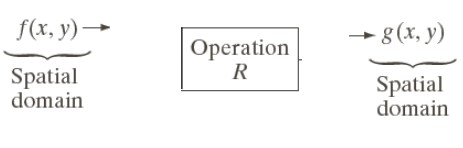

# Metode Spasial Dan Frekuensi Domain

## Sopia Refaldi - 2110131110004

Berdasarkan ranah (domain) operasinya, metode-metode untuk perbaikan
kualitas citra dapat dikelompokkan menjadi dua kategori:

- Image enhancement dalam ranah spasial

Metode-metode image enhancement dalam ranah spasial dilakukan
dengan memanipulasi secara langsung pixel-pixel di dalam citra

- Image enhancement dalam ranah frekuensi

Metode-metode image enhancement dalam ranah frekuensi
dilakukan dengan mengubah citra terlebih dahulu dari ranah spasial
ke ranah frekuensi, baru kemudian memanipulasi nilai-nilai frekuens
tersebut. 

Masing-masing ranah operasi digunakan untuk tujuan spesifik, karena
tidak semua perbaikan citra dapat dilakukan dalam ranah spasial.

## Metode dalam Ranah Spasial

Misalkan:

- <b>f(x,y)</b> : citra input

- <b>g(x,y)</b> : citra output

- T adalah operator terhadap f

Metode pemrosesan citra dalam ranah spasial dinyatakan sebagai:

- <b>g(x,y)</b> = T [ <b>f(x,y)</b> ]

T bisa beroperasi pada satu pixel, sekelompok pixel bertetangga, atau
keseluruhan pixel di dalam citra.

Jadi, metode dalam ranah spasial dapat dilakukan pada aras titik (pixel), aras
lokal, dan aras global. 

